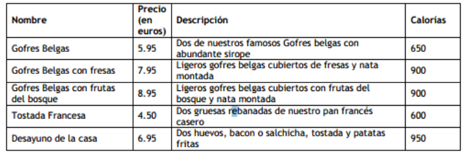

# ejercicioEquipo
Ejercicio grupal compuesto por [Osvaldo Martínez](https://github.com/Osvaldjmr), [Rolando Cepeda](https://github.com/Rolando-Cepeda) y [Ana María](https://github.com/AnaMariaVladPichiu) y servidor, Marco Ferreira para Desarrollo Web - Campus Digital San Blas

## ENUNCIADO

1. Solicita al usuario que elija entre la opción 1 o 2:
- Se le debe pedir dos números al usuario e indicar si son pares y múltiplos de 25 ambos, uno de ellos o ninguno.
- Se le debe pedir una palabra y comprobar si empieza o termina por a

2. Solicita una frase al usuario y contando los espacios que tiene, indica de cuántas palabras consta (debes presuponer que la frase tiene un único espacio entre palabras).

3. Realiza la tabla de la imagen con la misma información usando herramientas de DOM y JS, el body en HTML sólo puede tener la etiqueta script.

